# Github Pull Request Builder (GHPRB) Jenkins Plugin

Also see the [Installing Plugins](plugins.md) page.

## installing jenkins GHPRB plugin 

To enable Jenkins to build Pull Requests and act as a PR check, we need
to install the "Github Pull Request Builder" plugin into Jenkins.

Use Control + F to search for "Github Pull Request Builder" and check
the box next to it. Then click the button at the bottom that says
"Install without restart."

Now click the Installed tab on the plugin manager page to see a list
of plugins that are installed on the server: 

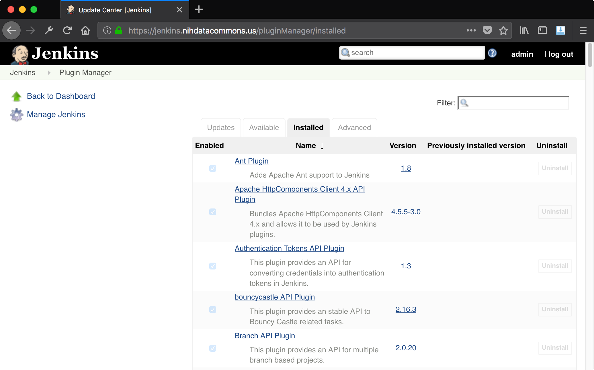

Control + F search for "Github Pull Request Builder" and you should
see it come up:

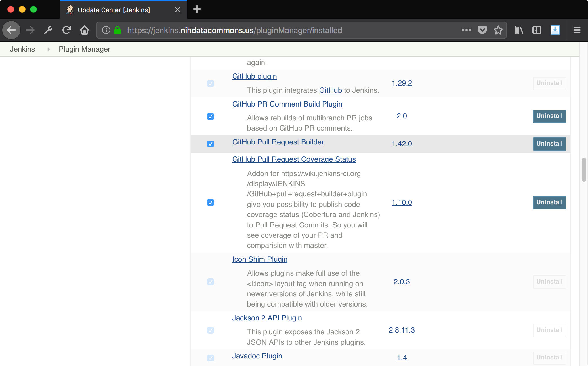

Don't bother clicking the link, since it will take you to
the Jenkins wiki page for the plugin. 

## getting to the jenkins configuration page

To configure the GHPRB plugin, start from the home view:

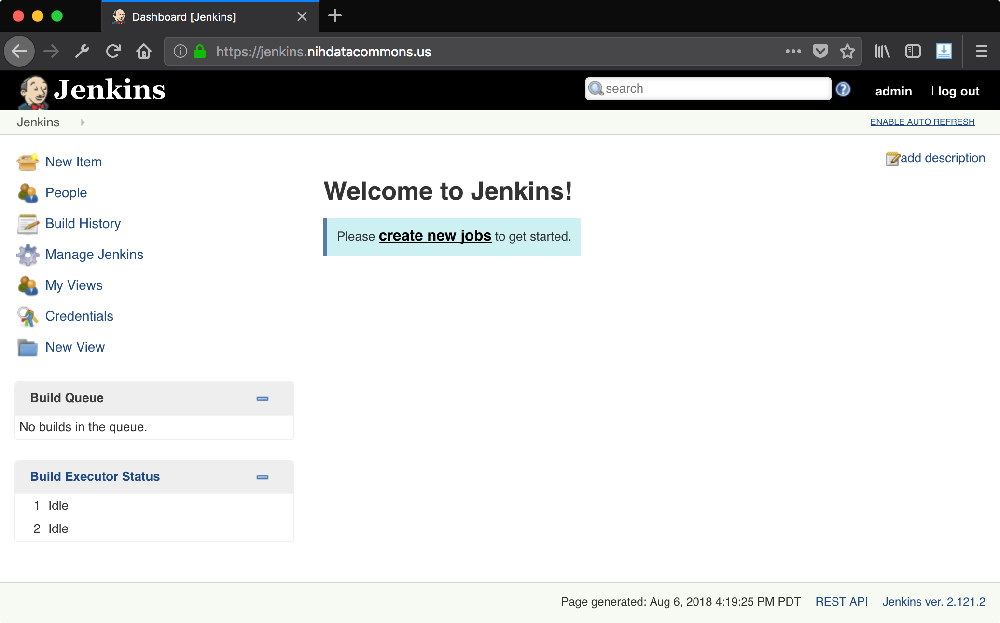

After clicking "Manage Jenkins" on the left, you should see a list of menu items:

After clicking the first item, "Configure System", you should see a page with
many sections:

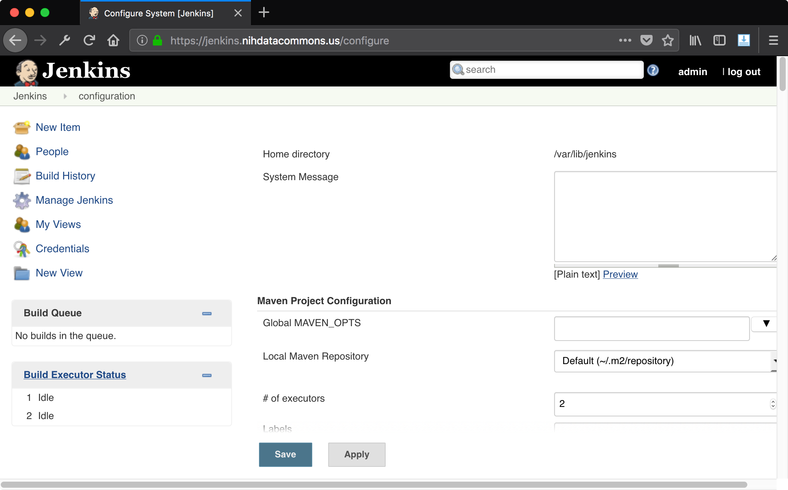

Let's go through how to set up the pull request build plugin
to properly authenticate with Github.

## configuring jenkins GHPRB plugin

Note: these steps are based largely on the README in the
[Github Pull Request Builder plugin
repo](https://github.com/jenkinsci/ghprb-plugin/blob/master/README.md)
(on Github, of course).

Once at the configuration page, scroll down to the section titled
"Github Pull Request Builder" (or Control + F it).

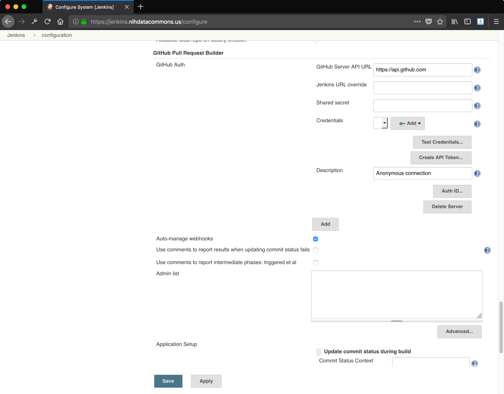

This has a couple of key fields:

* Github server API URL: this is for Github Enterprise users; leave as is if
  using Github.com

* Credentials: this is where we will add our Github credentials (log in under
  the bot account we want Jenkins to use).

* Connect to API: we will use this to test our credentials.

* Advanced: this button will open up a whole host of options. These are covered
  below.

## basic configuration

### authenticating with the Github API

Click the "Add" button next to credentials and select Jenkins as your 
credentials provider. Create a credential of Kind "Secret Text".
For the Secret, you will enter a Github Personal Access Token,
which we'll cover next.

Here is what the jenkins credentials provider looks like:

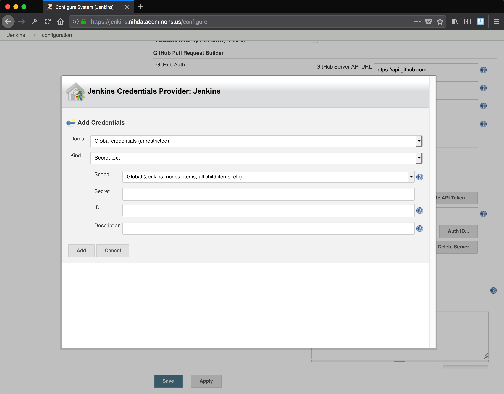

To create a Github Authentication Token, log in to Github using the account
jenkins will review PRs as. Go to the Settings page and click Developer Settings,
then Personal acess tokens, or just visit <https://github.com/settings/tokens>
once you are logged in.

Now click "Generate New Token". You will see some options like those shown
below. Configure the check boxes to match those shown in the image below:

Now create a token. The token will only be shown once, and cannot be viewed
again, so store it somewhere safe like a password manager.

Back at the jenkins credentials provider window, enter the
API key you generated into the "Secret" field. Leave the
other fields blank. Click Add.

Here's what the Github Pull Request Builder section of the jenkins configuration 
page will look like once you've authenticated with Github: 

Now test the authentication mechanism by clicking Test Credentials.

### testing authentication with Github

There are several tests to run to ensure Github authentication is
working okay.

Starting from the Github Pull Request Builder section of the configuration
page, click the Test Credentials button:

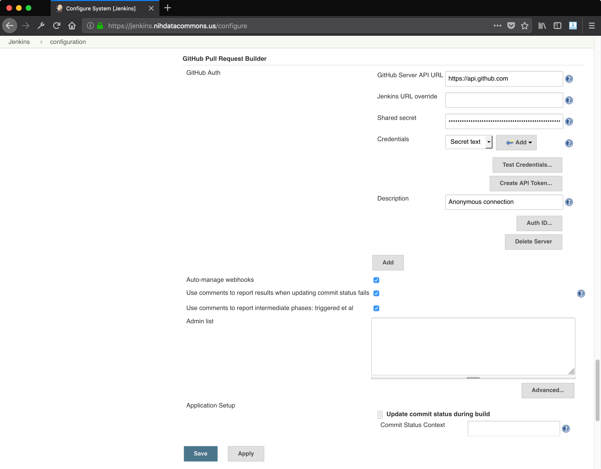

This opens several checkboxes with options. To run the given test,
you check the box. (Weird, I know.)

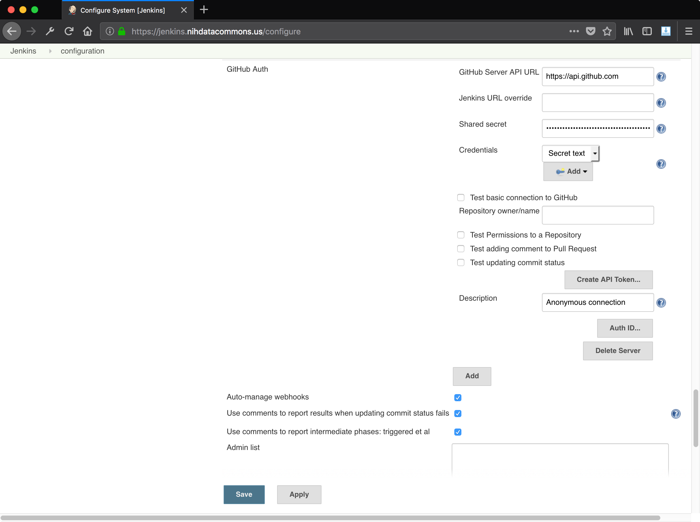

When you check the "Test basic connection to Github" box, you'll see
the results of checking that you can connect to Github:

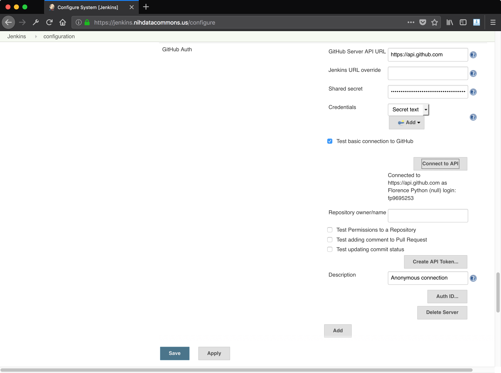

Enter a repository that your Jenkins user should have access to, 
and then check the next checkbox, "Test Permissions to a Repository":

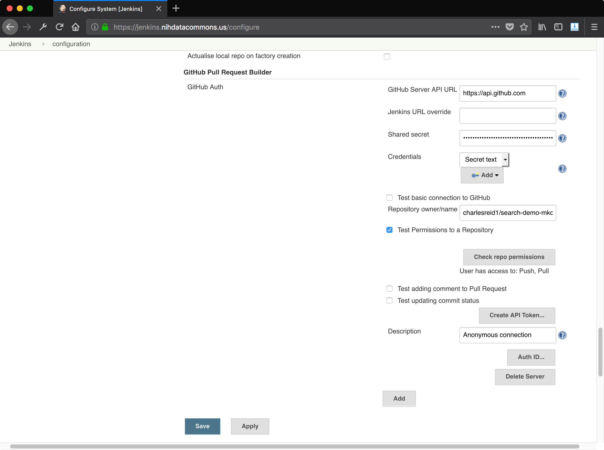

For the next test, you should create a pull request in the repository
that you entered in the text box. You can do this easily by opening
the README file in your repository, clicking the pencil "Edit" button
in Github, and adding an empty line at the top of the file.

When you click the green submit button, make sure you select the option
to create a new branch and start a pull request. Once you have submitted
the change as a pull request, click the "Pull Requests" tab of the repository
and find the pull request's number. In the example below, the pull request
is #1:

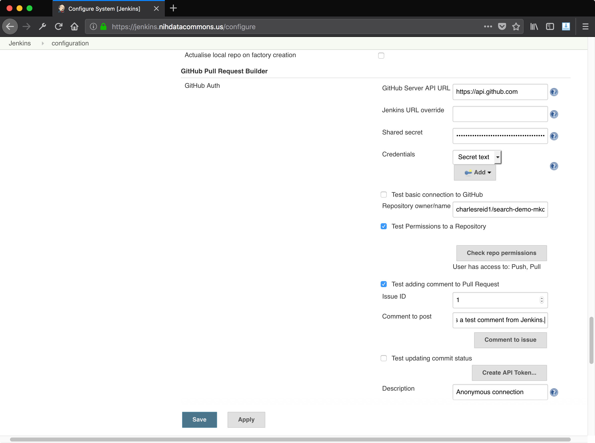

When you click "Comment to Issue", Jenkins will use the Github credentials
to attempt to leave the comment specified in the text box in the pull
request thread.

Here's what it should look like if everything goes according to plan:

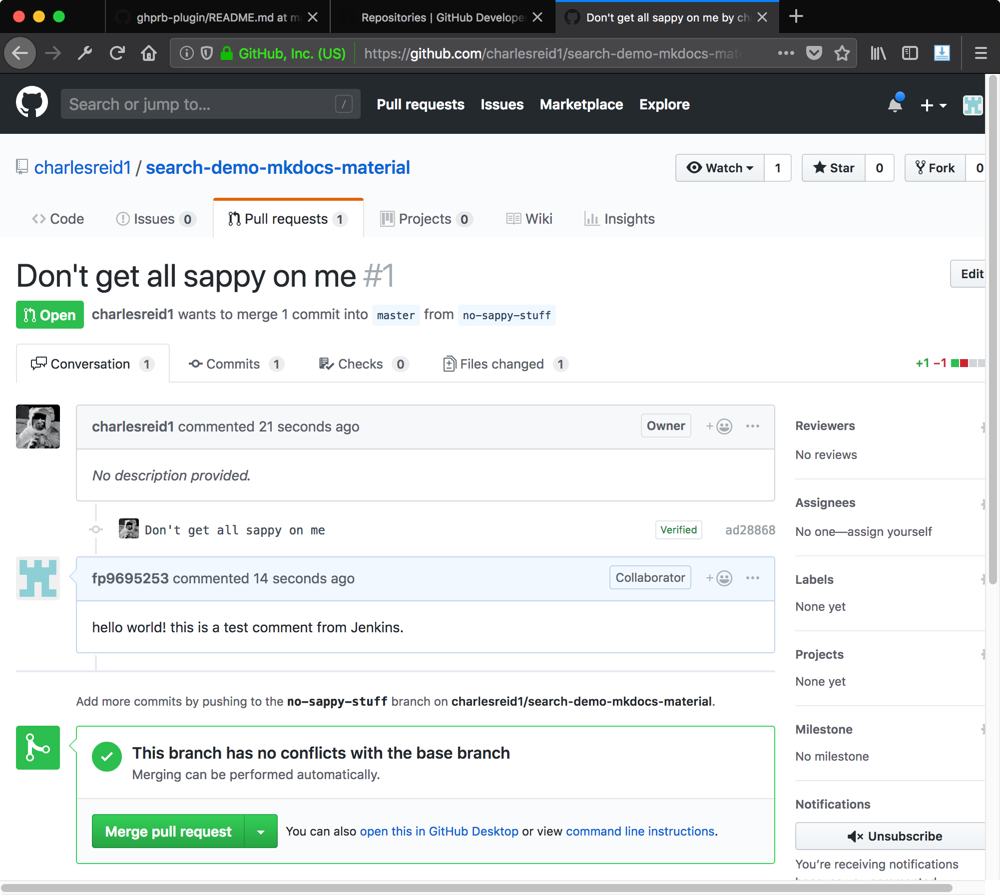

Let's keep moving through the tests, there is still one more to get through!

The last test is the most important, and that is testing whether the Jenkins
server can mark a pull request as passing or failing checks, or whether they
resulted in an error.

Click the "Test updating commit status" button and it will give several
options to set. For the commit hash, use the commit hash of the single
commit in the pull request. We will test setting the state to FAILURE.

The other settings will make more sense in context, but we can set a
URL that links to a page with more details on the build, a message
to post about the failure, and some context (more info).

Here is what the settings look like filled out:

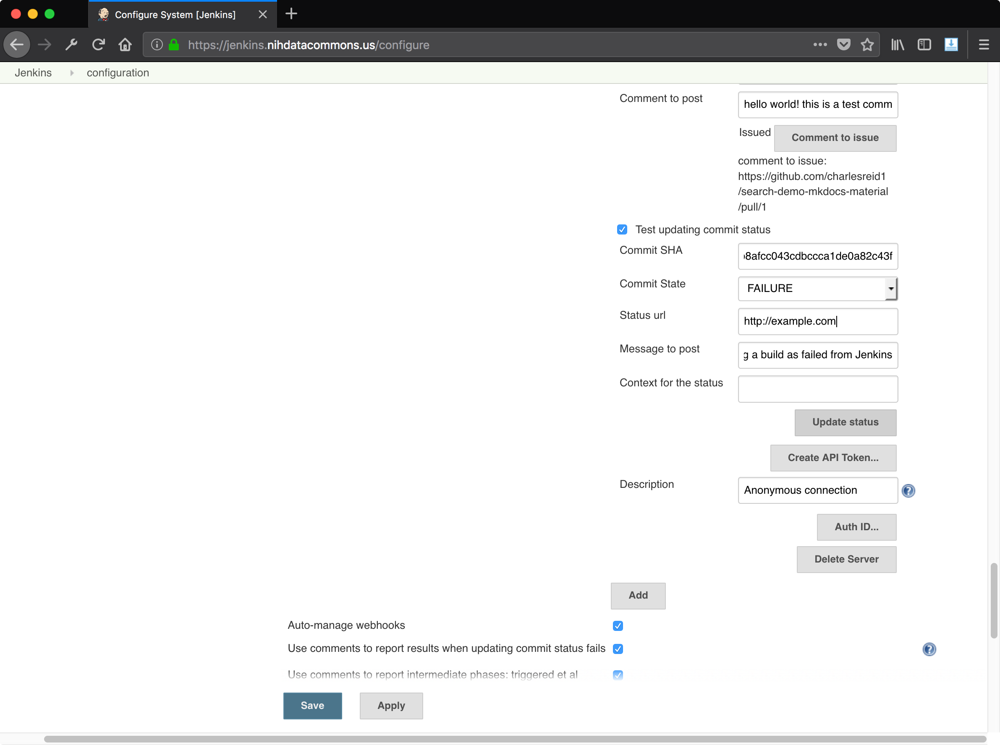

When "Update Status" is clicked it results in the following change to
the pull request page:

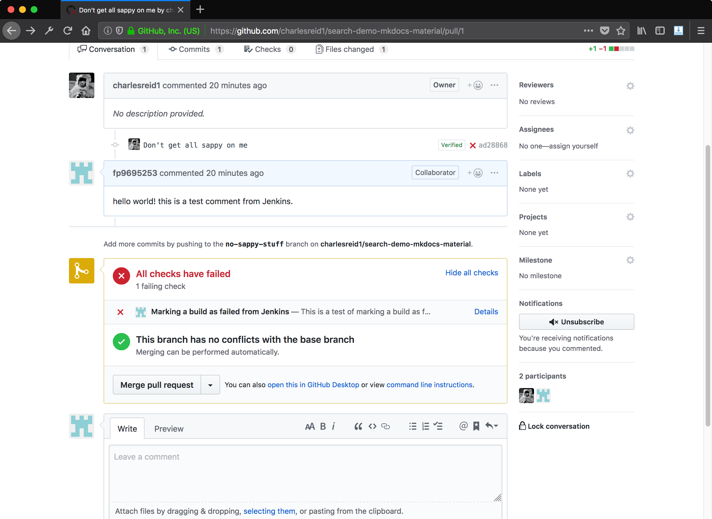

Note that the pull request can still be merged, but in the repository
settings we can require that build checks pass before any pull requests
can be merged.

